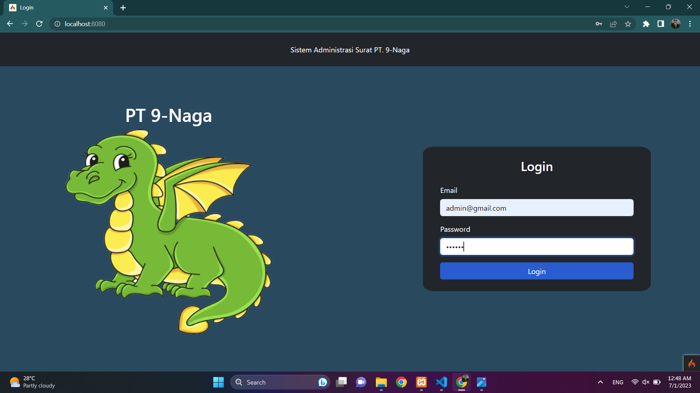

# Tugas Akhir Pemrograman Web 02 - Kelompok 9

<ol>
  <li>Satrio Pratama Wijaya = Membuat Kerangka Halaman</li>
  <li>Muhamad Suryanegara = Styling Halaman Surat-Masuk Pada Sisi User</li>
  <li>Muhammad Farhan = Styling Halaman Kirim-Surat Pada Sisi User</li>
  <li>Ihsan Nurul Alam = Styling Halaman Surat Masuk Pada Sisi Admin</li>
  <li>Rovyansyah = Styling Halaman Surat Keluar Pada Sisi Admin</li>
</ol>

<h1 align="center">Sistem Administrasi Surat Masuk Dan Surat Keluar</h1>

Sistem ini memungkinkan client untuk dengan mudah mengirim surat kepada perusahaan melalui halaman "Kirim Surat". Selain itu, admin perusahaan juga memiliki akses ke halaman "Surat Masuk" yang memungkinkan mereka untuk melihat surat-surat yang dikirim oleh client. Dengan fitur ini, admin perusahaan dapat dengan cepat meninjau dan menanggapi surat-surat yang diterima. Selain itu, kami juga telah menyediakan halaman "Surat Keluar" yang memungkinkan admin perusahaan untuk mengirimkan surat balasan kepada client dengan mudah dan efisien

<h2>1. Halaman Login</h2>

Menu login pada sistem kami memainkan peran penting dalam menentukan halaman yang akan diakses selanjutnya. Ketika seorang admin berhasil login, mereka akan diarahkan ke halaman beranda khusus admin yang menyediakan akses ke fitur-fitur dan kontrol penuh terhadap sistem.  Di sisi lain, ketika seorang pengguna berhasil login, mereka akan diarahkan ke halaman beranda pengguna yang ditujukan khusus untuk memberikan pengalaman yang optimal bagi mereka. 

 
<h2>2. Halaman Admin</h2>

saya telah berhasil membuat halaman admin yang sangat fungsional. Halaman ini dirancang khusus untuk memberikan kontrol penuh kepada admin dalam mengelola sistem surat perusahaan. Pada halaman utama, admin dapat dengan mudah mengakses berbagai fitur penting. Di dalam halaman utama tersebut, terdapat dua halaman penting yaitu "Surat Keluar" dan "Surat Masuk".

Halaman "Surat Keluar" berfungsi sebagai tempat admin mengirimkan surat balasan kepada pengguna. Dengan menggunakan antarmuka yang sederhana namun efisien, admin dapat mengisi formulir dengan informasi yang relevan dan mengirimkan surat balasan kepada pengguna dengan cepat dan mudah. Fitur ini memungkinkan admin untuk memberikan tanggapan yang cepat dan tepat kepada pengguna.

Sementara itu, halaman "Surat Masuk" memainkan peran penting dalam menampilkan data surat masuk yang dikirim oleh pengguna. Admin dapat melihat daftar surat masuk yang telah diterima dan dengan mudah mengelola dan menanggapi setiap surat. Halaman ini menyajikan informasi yang lengkap dan rapi, memungkinkan admin untuk dengan cepat menavigasi dan memeriksa setiap surat masuk dengan efisien.

